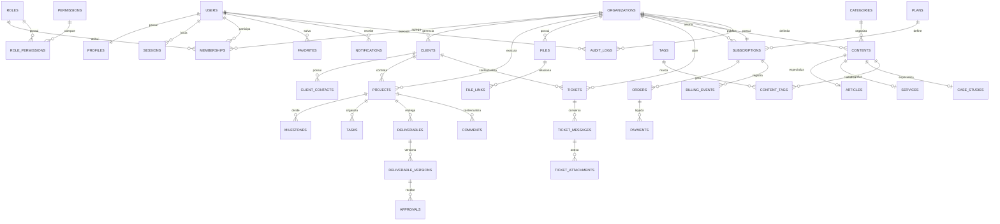

# Modelagem do Banco de Dados

## Princípios

- Identificadores opacos (`uuid` ou `ulid`);
- `created_at` e `updated_at` em registros mutáveis;
- Datas em UTC, localizadas apenas na interface;
- Exclusão lógica somente quando necessária para auditoria ou restauração;
- Chaves estrangeiras e restrições como parte das regras, não apenas da aplicação;
- `organization_id` obrigatório em todo dado pertencente a uma conta;
- Valores monetários armazenados em unidade mínima e acompanhados de moeda ISO.

## Implementado no marco atual

O ambiente independente usa PostgreSQL 17 no Supabase e migrações SQL versionadas. Estão implementadas vinte tabelas públicas: `profiles`, `organizations`, `memberships`, `organization_invitations`, `clients`, `projects`, `approvals`, `tasks`, `files`, `support_tickets`, `ticket_messages`, `activities`, `notifications`, `consents`, `content_categories`, `content_tags`, `content_items`, `plans`, `subscriptions` e `billing_events`.

Todas têm Row Level Security habilitada. Funções privadas verificam participação e papel usando a identidade da sessão. A tabela de convites não possui acesso direto: operações passam por RPCs `security definer` com `search_path` fixo, validação interna e execução revogada para `anon`. Os buckets `prismivo-files` e `prismivo-avatars` são privados e usam diretórios vinculados à organização ou ao usuário autenticado.

Essa fatia sustenta cadastro, isolamento por organização, colaboração, convites, perfis profissionais, avatares privados, clientes, projetos, tarefas, aprovações, arquivos, atendimentos, histórico, notificações, preferências, consentimentos, conteúdo publicável e cobrança demonstrativa.

Conteúdos globais só podem ser lidos anonimamente quando estão publicados e dentro da data de publicação. Conteúdos de empresa permanecem vinculados a `organization_id` e apenas `owner`, `admin` ou `editor` podem alterá-los. Planos são públicos para consulta; assinaturas e eventos financeiros são privados, e mudanças passam por uma RPC que valida sessão, papel, plano e preço no banco.

## Entidades por domínio

### Identidade e acesso

- `users`, `profiles`, `auth_accounts`, `sessions`, `verification_tokens`;
- `organizations`, `memberships`, `roles`, `permissions`, `role_permissions`;
- `security_events`, `consents`.

### Operação

- `clients`, `client_contacts`;
- `projects`, `project_members`, `milestones`, `tasks`;
- `deliverables`, `deliverable_versions`, `approvals`, `comments`;
- `files`, `file_links`, `favorites`, `activities`.

### Conteúdo e relacionamento

- `contents`, `articles`, `services`, `case_studies`;
- `categories`, `tags`, `content_tags`, `testimonials`, `faqs`;
- `notifications`, `notification_preferences`;
- `contacts`, `tickets`, `ticket_messages`, `ticket_attachments`, `ticket_ratings`.

### Financeiro e plataforma

- `plans`, `plan_features`, `subscriptions`, `orders`, `payments`, `coupons`, `coupon_redemptions`;
- `audit_logs`, `system_settings`, `webhook_events`, `analytics_events`.

## Diagrama lógico resumido

## Índices essenciais

- `users(lower(email))` único;
- `memberships(organization_id, user_id)` único;
- `clients(organization_id, status, created_at)`;
- `projects(organization_id, status, updated_at)`;
- `tasks(project_id, status, due_at)`;
- `approvals(deliverable_version_id, status)`;
- `notifications(user_id, read_at, created_at desc)`;
- `tickets(organization_id, status, priority, updated_at desc)`;
- `contents(status, published_at desc)` e `contents(slug, locale)` único;
- `subscriptions(organization_id, status)`;
- `webhook_events(provider, external_id)` único para idempotência;
- `audit_logs(organization_id, occurred_at desc)`.

Os índices do marco atual já cobrem e-mail e slug únicos, participação usuário/empresa, clientes, projetos, tarefas por status/responsável, arquivos ativos, chamados, mensagens, aprovações, notificações, atividades, conteúdo por estado/data/categoria/tags e eventos financeiros por organização.

## Cascata e retenção

- Excluir organização inicia fluxo controlado, nunca uma cascata imediata irreversível;
- Sessões e tokens expiram e podem ser removidos automaticamente;
- Conteúdo publicado usa exclusão lógica e histórico mínimo;
- Arquivos só são apagados após confirmar ausência de vínculos e política de retenção;
- Logs administrativos têm retenção definida e nunca guardam segredos ou conteúdo completo sensível.
